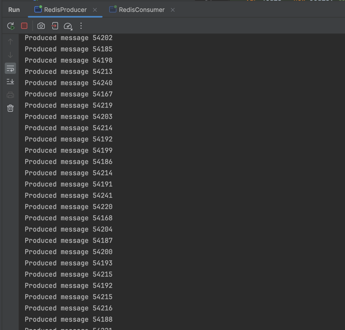
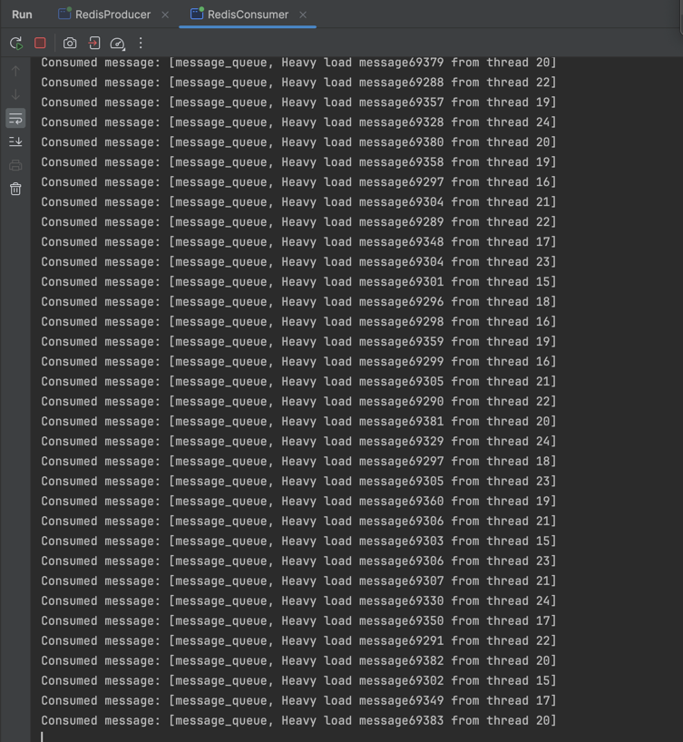
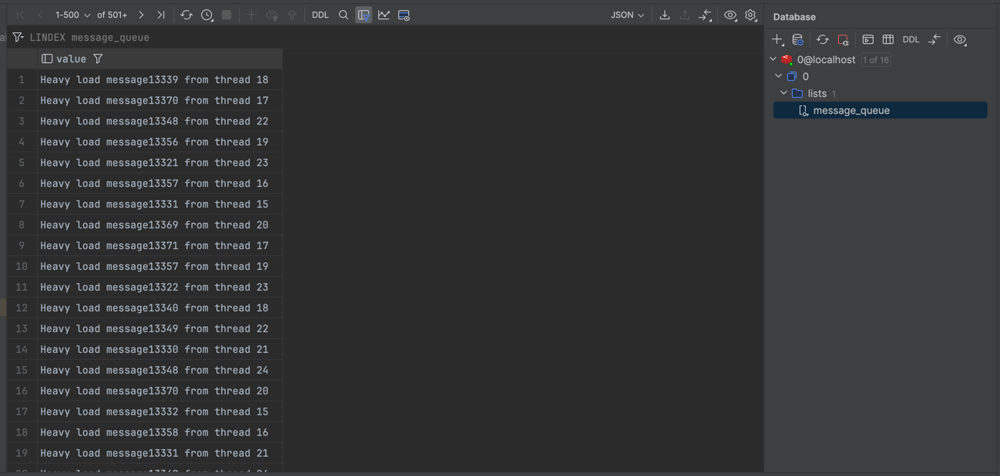
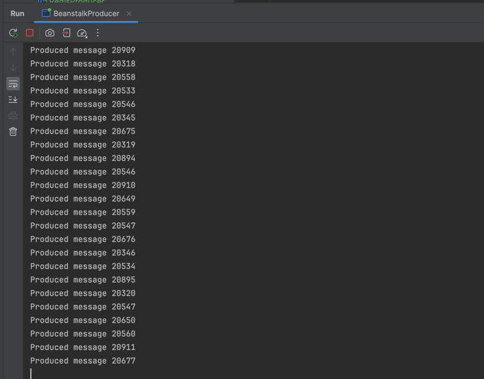
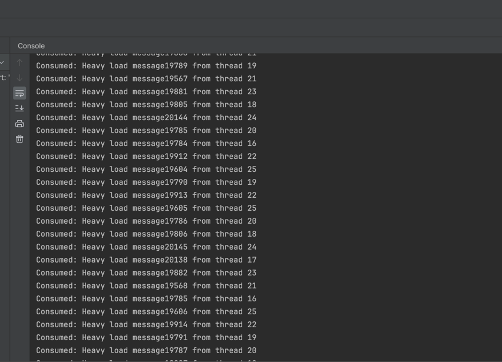

# Redis vs Beanstalkd

## Set up 3 containers - beanstalkd and redis (rdb and aof).

### Redis

[docker-compose_redis.yml](docker-compose_redis.yml)

```docker
version: '3.8'

services:
  redis-master:
    image: redis:latest
    container_name: redis-master
    ports:
      - "6379:6379"
    volumes:
      - ./conf/redis/redis-master.conf:/usr/local/etc/redis/redis.conf
      - ./data:/data
    command: redis-server /usr/local/etc/redis/redis.conf

  redis-slave-1:
    image: redis:latest
    container_name: redis-slave-1
    ports:
      - "6380:6379"
    volumes:
      - ./conf/redis/redis-slave.conf:/usr/local/etc/redis/redis.conf
      - ./data:/data
    command: redis-server /usr/local/etc/redis/redis.conf
    depends_on:
      - redis-master

  redis-slave-2:
    image: redis:latest
    container_name: redis-slave-2
    ports:
      - "6381:6379"
    volumes:
      - ./conf/redis/redis-slave.conf:/usr/local/etc/redis/redis.conf
      - ./data:/data
    command: redis-server /usr/local/etc/redis/redis.conf
    depends_on:
      - redis-master

volumes:
  redis-master-data:
  redis-slave-1-data:
  redis-slave-2-data:

```

### Beanstalkd

[docker-compose_beanstalkd.yml](docker-compose_beanstalkd.yml)

```docker
version: '3.8'

services:
  beanstalkd-1:
    image: schickling/beanstalkd
    container_name: beanstalkd-1
    platform: linux/amd64
    ports:
      - "11300:11300"
    volumes:
      - ./data/beanstalkd-1:/data
    environment:
      BEANSTALKD_PORT: 11300

  beanstalkd-2:
    image: schickling/beanstalkd
    container_name: beanstalkd-2
    platform: linux/amd64
    ports:
      - "11301:11300"
    volumes:
      - ./data/beanstalkd-2:/data
    environment:
      BEANSTALKD_PORT: 11300

  beanstalkd-3:
    image: schickling/beanstalkd
    container_name: beanstalkd-3
    platform: linux/amd64
    ports:
      - "11302:11300"
    volumes:
      - ./data/beanstalkd-3:/data
    environment:
      BEANSTALKD_PORT: 11300

volumes:
  beanstalkd-1-data:
  beanstalkd-2-data:
  beanstalkd-3-data:
```

---

## Write 2 simple scripts: 1st should put message into queue, 2nd should read from queue.

### Redis producer

[RedisProducer.java](src/main/java/demo/redis_vs_beanstalkd/RedisProducer.java)

```java
public void run() {
    var jedis = new Jedis("localhost", 6379, new JedisClientConfig() {
        @Override
        public String getPassword() {
            return "yourmasterpassword";
        }
    });

    for (var i = 0; i < MESSAGES_PER_THREAD; i++) {
        var message = jedis.blpop(0, QUEUE_NAME);
        System.out.println("Consumed message: " + message);
    }

    jedis.close();
}
```



### Redis consumer

[RedisConsumer.java](src/main/java/demo/redis_vs_beanstalkd/RedisConsumer.java)

```java
public void run() {
    var jedis = new Jedis("localhost", 6379, new JedisClientConfig() {
        @Override
        public String getPassword() {
            return "yourmasterpassword";
        }
    });

    for (var i = 0; i < MESSAGES_PER_THREAD; i++) {
        var message = jedis.blpop(0, QUEUE_NAME);// Blocking pop
        System.out.println("Consumed message: " + message);
    }

    jedis.close();
}
```



### Messages in Redis queue



### Beanstalkd producer

[BeanstalkProducer.java](src/main/java/demo/redis_vs_beanstalkd/BeanstalkProducer.java)

```java
public void run() {
    var client = new ClientImpl("localhost", 11300);
    client.useTube(QUEUE_NAME);

    for (var i = 0; i < MESSAGES_PER_THREAD; i++) {
        var message = MESSAGE + i + " from thread " + Thread.currentThread().getId();
        client.put(1, 0, 120, message.getBytes());
        System.out.println("Produced message " + i);
    }

    client.close();
}
```



### Beanstalkd consumer

[BeanstalkConsumer.java](src/main/java/demo/redis_vs_beanstalkd/BeanstalkConsumer.java)

```java
public void run() {
    var client = new ClientImpl("localhost", 11300);
    client.watch(QUEUE_NAME);  // Watch the tube for jobs

    for (var i = 0; i < MESSAGES_PER_THREAD; i++) {
        var job = client.reserve(10);

        if (job != null) {
            System.out.println("Consumed: " + new String(job.getData()));
            client.delete(job.getJobId());
        }
    }
    client.close();
}
```



---

## Сompare queues performance.

### Redis

> Produced 1000000 messages in 102801 ms

> Consumed 1000000 messages in 105286 ms

### Beanstalkd

> Produced 1000000 messages in 73960 ms

> Consumed 1000000 messages in 127202 ms


